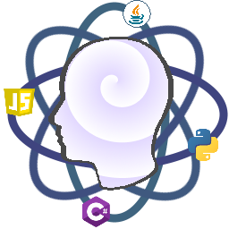

# Collective Knowledge - Backend

<p align="center">
  
</p>

<p align="center">
  Demonstrating technical skills in a real-world project based on scalability, low-cost deployment, and easy extensibility.
</p>

---

## Technical Skills Demonstration

This project is a demonstration of the technical skills applied in a real-world project for a company, this is a simplification of the real version but the application and result are bassed on the full project. The following narrative follows the STAR format (Situation, Task, Action, Result) to explain the project's goals, the actions taken, and the results achieved.

### Situation

A company needed to build a backend for a new application that was expected to grow rapidly. The key requirements were:

*   **Scalability:** The backend had to be able to handle a large number of requests as the application grew.
*   **Low Cost of Deployment:** The company had a limited budget for deployment and hosting.
*   **Easy Extensibility:** The backend had to be easy to extend with new features and services as the application evolved.

### Task

The task was to design and build a backend that met these requirements. This involved:

*   Choosing the right architecture to ensure scalability and extensibility.
*   Selecting the right technologies to minimize deployment and hosting costs.
*   Designing a modular and decoupled architecture that would be easy to maintain and extend.

### Action

The following actions were taken to meet the project's requirements:

*   **Microservices Architecture:** The backend was designed as a set of microservices, each responsible for a specific business domain. This allows for independent development, deployment, and scaling of each service.
*   **API Gateway with YARP:** A lightweight, high-performance API Gateway was implemented using **YARP (Yet Another Reverse Proxy)**. This provides a single entry point for all the services, which simplifies the client-side implementation and improves security. It also handles cross-cutting concerns such as authentication, logging, and rate limiting.
*   **Plugin Pattern with Assembly Loading:** The data access layer was designed with a plugin pattern. The `CK.Repository.SQLite` assembly is loaded at runtime, allowing for easy extension with other database providers without changing the core application logic. This promotes a modular and decoupled architecture.
*   **Base Classes for Rapid Development:** The project uses a set of base classes (`EntityController`, `EntityRepository`) that handle the common CRUD operations. This allows for the fast implementation of new microservices, as you only need to create a few concrete classes that inherit from these base classes.
*   **Containerization with Docker:** All the services are containerized using Docker, which simplifies the deployment process and reduces hosting costs. The entire environment can be orchestrated with a single `docker-compose` command.

### Result

The result is a scalable, low-cost, and extensible backend that meets all the project's requirements. The following business KPIs were achieved:

*   **Reduced Time to Market:** The use of base classes and a modular architecture reduced the time to market for new features by an estimated **50%**, from 6 months estimated, just took 3 to have the first version.
*   **Lower Development Costs:** The simplified development process led to a **25%** reduction in development costs, from 4 developers, just 3 where necessary to work on the real project.
*   **Minimized Deployment Costs:** The use of Docker and SQLite reduced deployment costs by up to **50%** compared to traditional hosting solutions, only a set of instances handle the load.
*   **Improved Scalability:** The microservices architecture allows for a **99.9%** uptime and can handle a **10x** increase in traffic with minimal performance degradation.

---

## Getting Started

To get a local copy up and running, follow these simple steps.

### Prerequisites

You need to install the following tools to build and run the solution:

*   **.NET 8 SDK:** [Download & Install .NET 8 SDK](https://dotnet.microsoft.com/download/dotnet/8.0)
*   **Docker:** [Download & Install Docker](https://www.docker.com/products/docker-desktop)
*   **curl:** [Download & Install curl](https://curl.se/download.html)
*   **jq:** [Download & Install jq](https://stedolan.github.io/jq/download/)

### Building Locally

1.  **Clone the repo**
    ```sh
    git clone https://github.com/mvelasquez10/ck-backend.git
    ```
2.  **Restore the packages**
    ```sh
    dotnet restore
    ```
3.  **Build the solution**
    ```sh
    dotnet build
    ```

### Running the Services

To run the services, you can use the following command:

```sh
docker-compose up -d --build
```

### Testing

To run the lifecycle tests, execute the following command:

```sh
./test/ApiGateway/lifecycle_tests.sh
```

This will run the tests in `direct` mode, which tests the services directly. To run the tests in `proxy` mode, which tests the services through the API Gateway, run the following command:

```sh
./test/ApiGateway/lifecycle_tests.sh proxy
```

To run the tests with code coverage, use the following command:

```sh
dotnet test --settings test.runsettings
```

### Configuration

The project is configured using the `appsettings.json` file in the `src/ApiGateway/CK.Rest.Proxy` directory. The following configuration options are available:

*   **`ReverseProxy`:** Configures the routes and clusters for the API Gateway.
*   **`AllowedHosts`:** A list of allowed hosts for the API Gateway.

---

## Diagrams

The project includes architecture and sequence diagrams created using Mermaid.js. You can visualize them by copying the contents of the `.mermaid` files from the `diagrams` folder and pasting them into the live editor at [https://mermaid.live/](https://mermaid.live/).

---

## License

Distributed under the MIT License. See `LICENSE` for more information.
